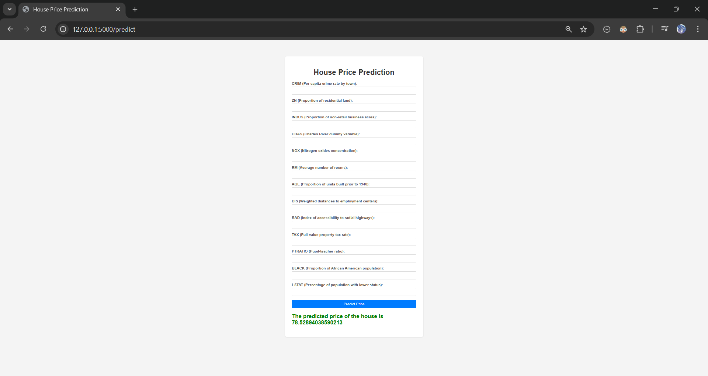

🏠 House Pricing Prediction Web App

A simple and interactive web application for predicting house prices using a machine learning model trained on the Boston housing dataset. Users can enter key property features through a web form and get a price prediction in real time.

📌 Project Overview

This project demonstrates how to build a full-stack machine learning application using:

🧠 Python & scikit-learn for modeling

💾 pickle for saving the trained model

🧪 Flask for creating an API and a web interface

🌐 HTML/CSS for the frontend user interface

🚀 Features

✔ Predict house prices based on 13 real estate factors
✔ User-friendly form for entering input values
✔ Real-time results shown on the web page
✔ Easy to extend for future improvements

```📁 Repository Structure
house_pricing/
│── app.py                  # Flask application
│── regmodel.pkl            # Serialized ML model
│── scaler.pkl              # Feature scaler
│── templates/
│   └── home.html           # Frontend HTML form
├── .gitignore
└── README.md
```

🧠 How It Works

Train a machine learning model (done separately)

Save the model and scaler with pickle

The user fills out property details in a form

Flask receives the input at route /predict

Scaler transforms the input

Model predicts the price

Result is displayed on the same page

📌 Dependencies

This project relies on:

Python 3.8+

Flask

scikit-learn

numpy

pandas

Note: These are usually installed via conda or pip.

📦 Installation

Clone the repository:

git clone https://github.com/Shakir-Hiflulla/house_pricing.git


Navigate to project directory:

cd house_pricing


Create and activate a Conda environment (recommended):

conda create -n houseenv python=3.12
conda activate houseenv


Install dependencies:

pip install flask scikit-learn numpy pandas

▶️ Run the App

Make sure the environment is active

Start the Flask server:

python app.py


Open your browser and go to:

http://127.0.0.1:5000


Fill in the form and click Predict Price to get the result!

🧪 Example Input

⚙ Sample house features:

```Feature	Example Value
CRIM	0.00632
ZN	18.00
INDUS	2.31
CHAS	0.00
NOX	0.538
RM	6.575
AGE	65.20
DIS	4.090
RAD	1.00
TAX	296.00
PTRATIO	15.30
BLACK	396.90
LSTAT	4.98 
```
📈 Screenshots



🛠 Future Enhancements

✨ Add user authentication
✨ Build a REST API for mobile clients
✨ Deploy to cloud (Render, Railway, Heroku)
✨ Add charts and graphs
✨ Store records in a database